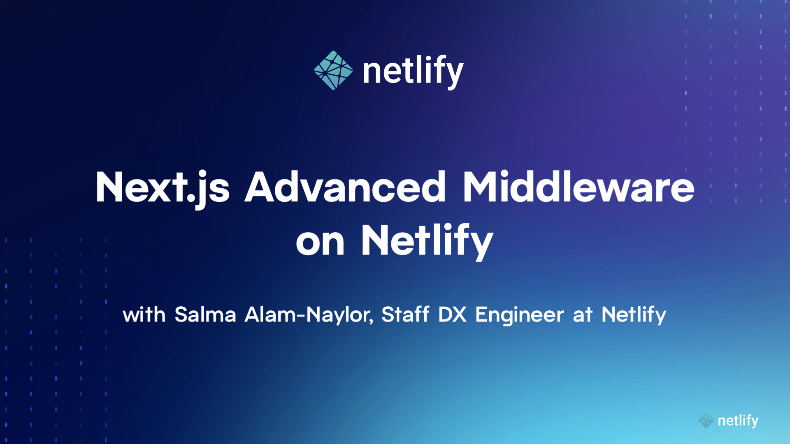

# Next.js Advanced Middleware Demo — _only on Netlify_

Next.js developers! Do you wish you could do **_MORE_** with middleware?

Do you want to be able to intercept and modify the response of a **statically generated** page based on geolocation data
for example? Do you also want to be able to transform page **_data_** on the fly?

Now you can! With Next.js Advanced Middleware. It’s powered by Netlify Edge Functions, brand new and only on Netlify.

---

## Documentation

With <strong>@netlify/next</strong>, you get access to enhanced request and response features through an intuitive API.
[Read more on the docs](https://ntl.fyi/3A0KcUD).

---

## Watch the video tutorial

[](https://youtu.be/_KZIs-8oulw)

---

## Play with the code

### Prerequisites

Make sure you've installed the [Netlify CLI](https://www.npmjs.com/package/netlify-cli) — which brings the power of
Next.js Advanced Middleware to your development environment.

Check you're on the latest version with the following command, and update if your package is not up to date!

```bash
netlify --version
```

Fork the repository to your GitHub account and clone it to your local machine.

Install dependencies:

```bash
npm install
```

Start the development server using the Netlify CLI:

```bash
netlify dev
```

And a browser tab will automatically open at [http://localhost:8888](http://localhost:8888).

You can start editing pages by modifying `pages/index.js` or `pages/static.js`. The pages auto-update as you edit the
files.

To experiment with the transformed response on `pages/static.js`, open up `middleware.ts`, and have fun!

## Deploy on Netlify

Instantly deploy this tutorial site to your own Netlify account:

[](https://ntl.fyi/3K7uewQ)
